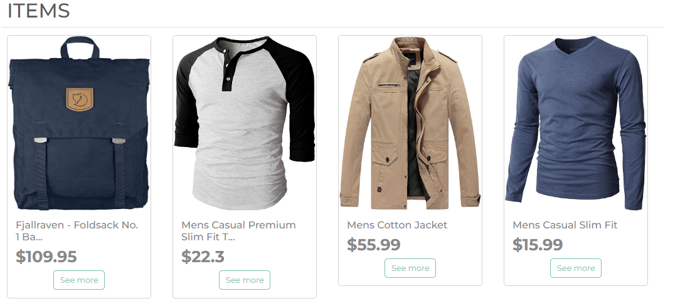
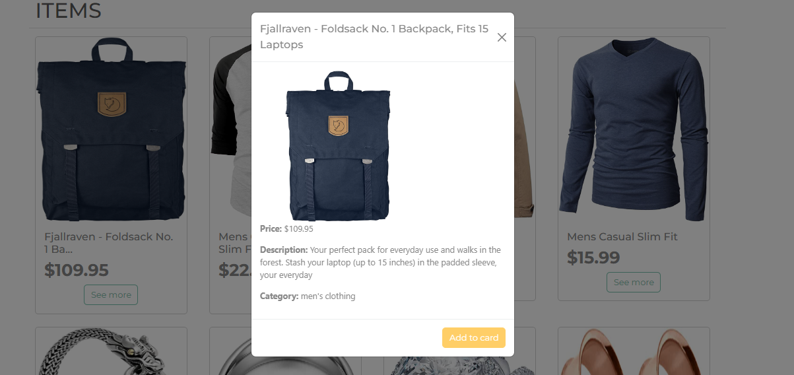

# Clothing Store, api with php

Consuming the fakestore api with the php cURL library to create a ministore

## cURL (clientURL)

Curl is a library of functions to connect to servers to work with them. The work is done in URL format. In other words, it is used to carry out actions on files that are in Internet URLs, supporting the most common protocols, such as http, ftp, https, etc.

&copy; Stive Ospina :)